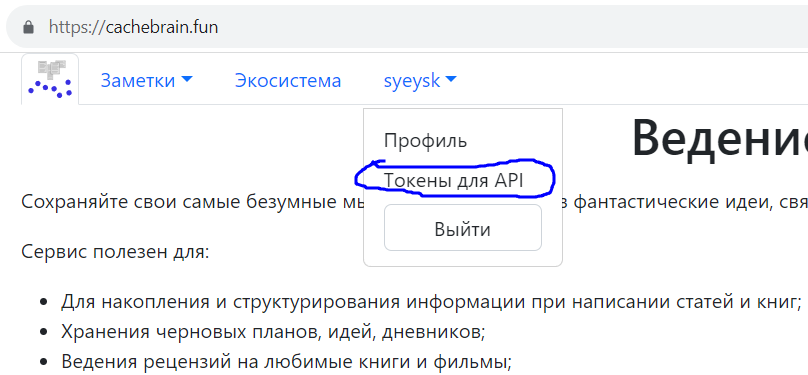

# Библиотека для доступа к микросервисам Платформы через API

## Использование

Установите библиотеку:
- `pip install git+https://github.com/syeysk/sy_api.git`

Для доступа к микросервисам необходим токен, получить который можно на странице "Токены для API":
<p align="center"></p>

Для каждого микросервиса - отдельный токен.

## Микросервис заметок

Пример:
```python
from syapi.note import Note

token = 'here-your-token'
note = Note(token)

title = 'Заметка для теста'
content = 'а это её содержимое))'
note.create(title, content)
print(note.get(title))
new_title = 'Заметка для теста (обновлён заголовок)'
note.update(title, new_title=new_title)
note.update(new_title, new_content='ну вот и содержимое обновилось')
print(note.get(new_title))
note.delete(new_title)
```

Пример выведет следующее:
```plain
{'title': 'Заметка для теста', 'content': 'а это её содержимое))', 'source': 'default'}
{'title': 'Заметка для теста (обновлён заголовок)', 'content': 'ну вот и содержимое обновилось', 'source': 'default'}
```

Методы `create`, `get`, `update`, `delete` могут принимать последний аргумент `source`.
Если не указан, то будет использовано свойство `Note.default_source`.

Свойства класса `Note`:
- `Note.default_source` - идентификатор базы по-умолчанию. Если равно `None` (по-умолчанию),
  то будет использована база, являющая по-умолчанию на сервере.
- `Note.url_microservice` - URL микросервиса заметок. По-умолчанию - `https://cachebrain.fun`.
  Переопределив это свойство, можно, например, делать запросы к локальной копии микросервиса.

## Микросервис авторизации

Импорт класса пользователя:
```python
from syapi.auth import User
```

Для получения доступа есть 3 метода:
```python
user = User()
# через имя пользователя и пароль
userdata = user.login(username, password)
# либо через регистрацию
userdata = user.registrate(username, password, email)
# либо через внешний сервис авторизации
userdata = user.login_or_registrate_by_extern(extern_service, extern_token, extra)
```

Методы `user.login` и `user.login_or_registrate_by_extern` вернут словарь, содержащий следующие поля:
- `microservice_auth_id` - глобальный идентификатор пользователя
- `last_name` - фамилия пользователя
- `first_name`- имя пользователя
- `is_staff` - временно не используется, всегда равен `False`
- `is_active` - временно не используется, всегда равен `False`
- `is_superuser` - временно не используется, всегда равен `False`

Метод `user.registrate` вернёт словарь, содержащий всего одно поле:
- `microservice_auth_id` - глобальный идентификатор только что зарегистрированного пользователя

После успешного получения доступа можно извлечь данные для доступа, чтобы сохранить их в надёжное место:
```python
serialized_auth_data = user.serialize()
```

Метод `user.serialize` вернёт словарь, содержащий поля (все значения - строковые):
- `microservice_auth_id` - глобальный идентификатор пользователя
- `token` - токен доступа, подтверждающий, что пользователь был авторизован ранее (токен имеет срок жизни)
- `auth_public_key` - публичный ключ. Им шифруются данные, отправляемые в микросервис авторизации
- `public_key` - публичный ключ. Им зашифрованы данные, полученные от микросервиса авторизации
- `private_key`- приватный ключ. Им расшифровываются данные, полученные от микросервиса авторизации

Сериализованные данные, извлечённые методом `user.serialize` можно передать как аргументы при инициализации класса `User`:
```python
user = User(token, microservice_auth_id, auth_public_key, private_key, public_key)
```

После такой инициализации доступ уже получен.

Когда пользователь имеет доступ, можно управлять этим пользователем:
```python
# получить информацию о пользователе
user_data = user.get()
# редактировать информацию о пользователе
changed_fields = user.put(first_name='new first name')
# удалить пользователя
user_data = user.delete()
```

## Микросервис ресурсов

Пример:
```python
from syapi.fabric import Fabric

token = 'here-your-token'
fabric = Fabric(token)

fabric_data = fabric.create(title='My test fabric')
print(fabric.get(fabric_data['id']))
```

Выведет:
```json
{"id": 1, "title": "My test fabric"}
```

## План разработки библиотеки

- [Дорожная карта](ROADMAP.md)